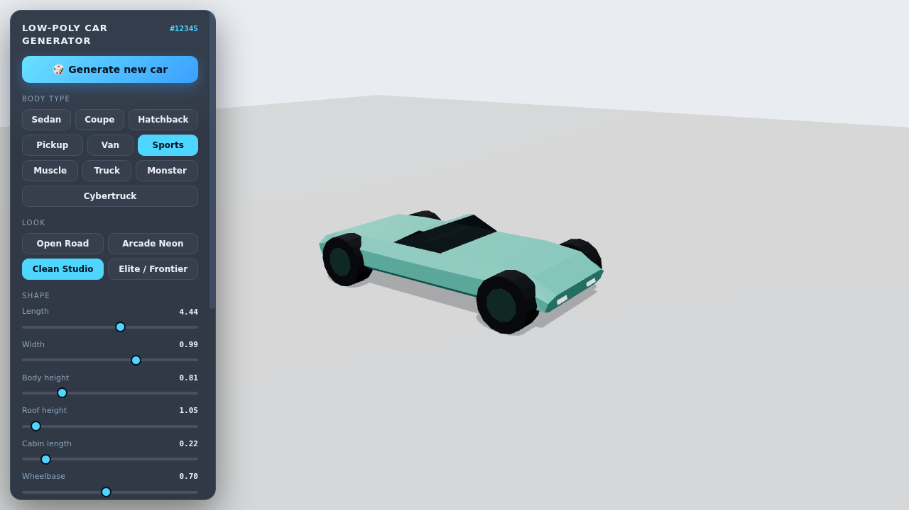

# Low Poly Car Generator

Create and export customizable low poly 3D cars in your browser.



**Live generator:** https://3d.mediageni.com/low-poly-car-generator/

Run locally with a static web server from this directory, then open its local URL in a browser. For example:

```sh
python3 -m http.server 8000
```

The generator uses Three.js and exports models as GLB or OBJ. The bundled Three.js files are covered by their own MIT license in [`js/vendor/LICENSE-threejs`](js/vendor/LICENSE-threejs). The generator code is available under the [MIT License](LICENSE).
